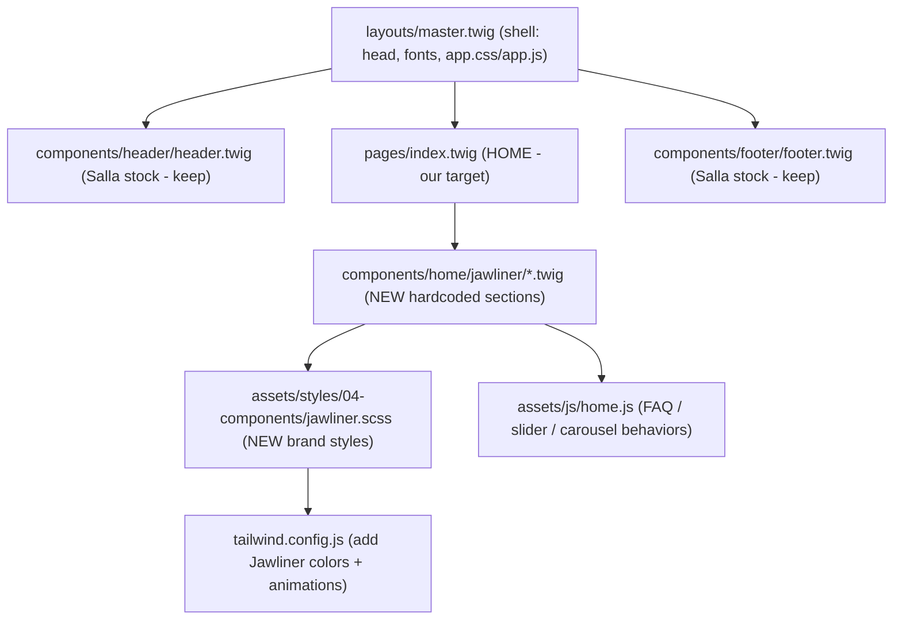

# Jawliner → Twilight (Twig) migration

**Status:** Phase 1 (static) — implemented; asset filename fix applied 2026-06-19  
**Active scope:** Hardcoded static home through all sections (todos 1–5). **Phase 2+ deferred** — see §6b.
**Indexed from:** [THEME-DOCS-INDEX(main).md](./THEME-DOCS-INDEX(main).md)  
**Related:** [TWILIGHT-MIGRATION-EXECUTION-PLAN.md](./TWILIGHT-MIGRATION-EXECUTION-PLAN.md) · [TWILIGHT-MIGRATION-REQUIREMENTS.md](./TWILIGHT-MIGRATION-REQUIREMENTS.md) · [SALLA-THEME-RAED-CONNECT-CONCLUDE-2026-06-19.md](./SALLA-THEME-RAED-CONNECT-CONCLUDE-2026-06-19.md)

---

## 0. Goal (simple)

Turn the **static Jawliner single page** (`Jawliner(old)/index.html` — Tailwind + vanilla JS, RTL) into a **real Salla Twilight theme home page** that:

- Renders on the demo store via **Chrome hybrid preview** (local dev loop).
- Keeps Salla platform behavior for cart, search, login, checkout.
- Starts **hardcoded** (guaranteed to render), then becomes merchant-editable via `twilight.json`.

---

## 1. Decisions (locked in)

| Decision | Choice |
| -------- | ------ |
| **Target page** | Store **home** — [`src/views/pages/index.twig`](../src/views/pages/index.twig) |
| **First approach** | Hardcoded Twig partials → verify in preview → then `twilight.json` components |
| **Source of truth** | `Jawliner(old)/` (reference only; already in `.gitignore`) |
| **Ignore** | `Jawliner-Saudi-V2(broken twighlight)/` — delete later |
| **Theme / repo** | Stay on **Theme Raed** `1507984290` / `Mrufaihi/theme-raed` — do **not** repoint to Jawliner repos or old theme IDs |
| **Brand colors** | Fixed Jawliner identity (dark + lime `#c2dc04`) — not driven by merchant `theme.color.primary` for MVP |
| **Animations (MVP)** | **Minimal.** Salla `<salla-slider>` for carousels/sliders + Tailwind hover/transition utilities only. **No** hand-rolled entrance/scroll-reveal JS for the first pass |
| **Scroll-reveal animations** | **Deferred** to a later polish phase — sections ship static/visible first |
| **CSS approach** | **Tailwind-first.** Custom SCSS kept to the minimum that utilities cannot express (keyframes, gradients, marquee) |

---

## 2. Big picture — what we are (and are not) building

The repo root is **already** a working Theme Raed Twilight theme (`twilight.json`, `src/views/`, webpack → `public/`). We are **not** rebuilding the shell from blank HTML.

We **port the Jawliner body** into the existing theme:



**Keep from Salla (do not hand-roll):**

- Header cart, search, login modals (`<salla-search>`, `<salla-login-modal>`, etc.)
- Footer platform links / merchant settings
- Product catalog, cart, checkout flows
- `` injection points in [`master.twig`](../src/views/layouts/master.twig)

**Replace / add:**

- Home page content (currently `` only)
- Jawliner-specific SCSS + JS behaviors
- Assets under `src/assets/` referenced via `| asset`

---

## 3. Old page inventory

Source: `Jawliner(old)/index.html` (~1,540 lines)

| # | Section | Old location | New Twig partial | JS needed |
| - | ------- | ------------ | ---------------- | --------- |
| 1 | Promo bar + header | inline `<header>` | Keep [`header.twig`](../src/views/components/header/header.twig) — restyle later | Salla stock |
| 2 | Hero (video) | `#hero` | `components/home/jawliner/hero.twig` | lazy video only (no entrance anim for MVP) |
| 3 | Moving brand-logo bar | `#products` (logo slider) | `.../logo-bar.twig` | CSS marquee (Tailwind keyframe) — no JS |
| 4 | Product box | `#product` | `.../product.twig` | — (later: Salla product) |
| 5 | Before/after slider | comparison section | `.../comparison.twig` | small drag handler (only custom JS kept) |
| 6 | Zigzag features | zigzag section | `.../zigzag.twig` | none for MVP — static, scroll-reveal deferred |
| 7 | Testimonial video carousel | testimonial section | `.../testimonials.twig` | **`<salla-slider>`** (replaces hand-rolled carousel) |
| 8 | FAQ accordion | FAQ section | `.../faq.twig` | small accordion handler |
| 9 | Footer | inline `<footer>` | Keep [`footer.twig`](../src/views/components/footer/footer.twig) — restyle later | Salla stock |

**Old JS files (reference):**

- `Jawliner(old)/src/app.js` — carousel, slider, FAQ, scroll. **Mostly do NOT port verbatim** — replace carousel with `<salla-slider>`; keep only the FAQ accordion + before/after drag handlers.
- `Jawliner(old)/src/lang-switch.js` — **do not port** (use Salla locales)
- `Jawliner(old)/src/lazy-videos.js` — port pattern into theme `home.js`
- `Jawliner(old)/src/components.js` — color CSS variables (port to `tailwind.config.js` + minimal SCSS)

### Why the old animations are being dropped (truths)

- **Twig does not animate** — it is a server-side templating engine; it renders HTML only. There is no "Twig animation" alternative.
- **Salla replaces carousels/sliders** — the theme already uses `<salla-slider>` (Swiper-based: `auto-play`, `controls-outer`, `data-swiper-parallax`) in `custom-testimonials.twig`, `photos-slider.twig`, `enhanced-slider.twig`, `products-slider.twig`. Use it instead of the hand-rolled video carousel.
- **anime.js is already bundled** (`src/assets/js/partials/anime.js`) — available later if entrance/stagger animation is wanted, without adding a dependency.
- **Old scroll-reveal failed due to a CSS specificity bug**, documented in `Jawliner(old)/docs/SCROLL-ANIMATION-REPORT.md` (`.zigzag-animate-ready .zigzag-left` [0,2,0] beat `.zigzag-animate` [0,1,0]). It was fragile, not impossible — but for MVP we ship sections **static/visible** and defer reveals.

---

## 4. Style & build strategy

### 4.1 Tailwind

Theme root [`tailwind.config.js`](../tailwind.config.js) scans `src/views/**/*.twig` and `src/assets/js/**/*.js`. It does **not** yet define Jawliner tokens.

**Add to `theme.extend` (MVP):**

- Colors: `primary`, `secondary`, `accent`, `product`, `logo-bar`, `fesfor` (from old `tailwind.config.js` + `input.css`)
- Keyframes/animation: **only `logoSlide`** (the logo marquee) for MVP.
- **Deferred:** `fadeIn`, `slideUp`, `slideDown`, `wiggle`, `bouncy` and their `animate-*` classes — add only when the scroll/entrance polish phase happens.

### 4.2 SCSS (Tailwind-first, minimal)

Per the CSS decision: **prefer Tailwind utility classes in markup.** Only create custom SCSS for what utilities genuinely cannot express.

Create [`src/assets/styles/04-components/jawliner.scss`](../src/assets/styles/04-components/jawliner.scss) (imported in [`app.scss`](../src/assets/styles/app.scss)) containing the **minimum**:

- Brand palette CSS variables (or move into `tailwind.config.js` colors where possible)
- `.bg-primary` radial-gradient background (cannot be a pure utility)
- `.logo-slider` marquee animation
- FAQ open/close state (`.faq-content`, `.single-faq.open`) — small

**Do NOT port for MVP:** `.zigzag-*` reveal classes, `.section-fade-in/out` pseudo-element fades, `.text-glow`, `.btn-outline`, the many `animate-*` keyframes. Re-evaluate per section; most hover/spacing/layout becomes Tailwind utilities directly in the Twig.

**Note:** Raed uses Tailwind `@apply` in SCSS — match that convention, not raw `@tailwind` directives.

### 4.3 JavaScript

Keep custom JS to the **bare minimum**. Extend [`src/assets/js/home.js`](../src/assets/js/home.js) (already `Home.initiateWhenReady(['index'])`):

| Behavior | MVP approach | Theme target |
| -------- | ------------ | ------------ |
| FAQ accordion | Small handler (keep) | `home.js` → `initFaq()` |
| Before/after slider | Small drag handler (keep — no Salla equivalent) | `home.js` → `initComparisonSlider()` |
| Video carousel | **Replace with `<salla-slider>`** (no custom JS) | Twig markup in `testimonials.twig` |
| Zigzag / scroll reveal | **Dropped for MVP** (deferred) | — |
| Logo marquee | **CSS only** (`logoSlide` keyframe) | `jawliner.scss` / Tailwind |
| Lazy videos | Port pattern | `home.js` or shared partial |

Use `BasePage` / `app.all()` patterns already in the theme — do not add a second global script. Do not re-implement the old `app.js` scroll/animation blocks.

### 4.4 Assets

Move from `Jawliner(old)/assets/` → `src/assets/images/jawliner/` (webpack **CopyPlugin** → `public/images/jawliner/`).

Reference in Twig:

```twig

```

**How Salla serves them (not server-side processing):**

| Mode | What happens |
| ---- | -------------- |
| **Hybrid preview** (`?assets_url=http://localhost:8000`) | Twig outputs a URL pointing at your local **theme serve** — same pipe as `app.css` / `app.js`. |
| **CDN / live store** | After `theme publish`, assets ship in the theme bundle on `cdn.assets.salla.network`. |

**Filename rule (required):** use **kebab-case, no spaces** in paths under `images/jawliner/`. The local asset server returns **404** for spaced names (e.g. `jawliner gum mint.webp`). Renamed 2026-06-19 — see [§4.4b](#44b-asset-fixes--deferred).

**Large MP4s:** caused preview timeouts before ([SALLA-PREVIEW-TIMEOUT-AND-ASSETS-CONCLUDE.md](./SALLA-PREVIEW-TIMEOUT-AND-ASSETS-CONCLUDE.md)). Keep testimonial clips small for dev; production strategy in §4.4b.

### 4.4b Asset fixes & deferred

**Fixed (2026-06-19):** renamed all Jawliner assets with spaces → kebab-case; updated Twig `| asset` paths. Symptom: logo bar (clean SVG paths) loaded; hero/product/comparison did not.

| Old name | New name |
| -------- | -------- |
| `JAWLINER BANNER MAIN BG REMOVE cropped 3 (4).png` | `hero-banner.png` |
| `jawliner gum mint.webp` | `jawliner-gum-mint.webp` |
| `24 PX.svg` | `sar-24px.svg` |
| `lame ah jaw 1920 final 1.png` | `jaw-before.png` |
| `x8 last jaw 1920 px 4.png` | `jaw-after.png` |
| `Chewing_Gum_Normal 1.png` | `chewing-gum.png` |
| `tiktok 2.mp4` / `tiktok 4.mp4` | `tiktok-2.mp4` / `tiktok-4.mp4` |

**Deferred (later ticket / Phase 2):**

| Task | Why later |
| ---- | --------- |
| **Video production strategy** | `tiktok-*.mp4` are 7–26MB each; compress, host on Salla CDN or external URL before go-live; avoid bloating `public/` on every preview sync. |
| **Header store logo** | Broken image beside “JAWLINER” in stock `header.twig` = merchant logo in Salla dashboard — not Jawliner partials. Set in store settings or restyle header in M7. |
| **Comparison image weight** | `jaw-before.png` / `jaw-after.png` are ~4–5MB each — optimize WebP for production. |
| **Console noise** | Permissions-Policy, `cdn.translations.salla.network` 500, `Failed to parse mobile headers` — Salla platform; safe to ignore for theme dev. |
| **CLI `Tag already exists`** | Salla CLI sync issue — retry preview or bump theme version; see [SALLA-THEME-RAED-CONNECT-CONCLUDE §15](./SALLA-THEME-RAED-CONNECT-CONCLUDE-2026-06-19.md). |
| **i18n** | Replace hardcoded Arabic with `trans()` + locale files (Phase 2). |
| **Layout / image placement** | Hero, comparison, and section spacing visually buggy — see [§4.4c](#44c-known-layout-bugs-deferred--do-not-fix-in-phase-1). |

**Verify after rename:** DevTools → Network → filter `jawliner` → image URLs should be **200** from `localhost:<port>/images/jawliner/...`.

### 4.4c Known layout bugs (deferred — do not fix in Phase 1)

**Status (2026-06-19):** sections render and assets load after the filename fix, but the static home is **visually rough / buggy**. Acceptable for proving the Twig + preview pipeline; **not** acceptable for go-live.

**Symptoms observed in Chrome hybrid preview:**

| Area | Issue |
| ---- | ----- |
| **Hero** | Banner image placement wrong — oversized, overlapping text/CTA, not matching old `index.html` composition. Likely `lg:absolute` / container height without a proper positioned parent. |
| **Comparison** | Before/after slider floats in wrong place (e.g. over hero/forehead in screenshot) — images use `object-contain` + `clip-path` inside a `min-h-[37vh]` box that may not match image aspect ratio. |
| **General** | Images “all over the place” — spacing, alignment, and section rhythm not ported faithfully from the prototype. |
| **Containers** | Suspected **Raed `container` / Salla shell** vs old page full-bleed layout — Jawliner partials dropped into Theme Raed without layout isolation or section-specific wrappers. |

**Likely causes (for later investigation):**

1. Minimal port — Tailwind classes copied without old page’s positioning context (`relative` parents, hero structure, zigzag grid).
2. No Jawliner-specific layout SCSS yet — only brand colors + FAQ/marquee in `jawliner.scss`.
3. Stock `master.twig` / main content area constraints vs old standalone HTML page.
4. Comparison slider still uses inline `clip-path` from prototype — known fragile in old repo too (`Jawliner(old)/docs/ISSUE-SEE-DIFFERENCE-IMAGE-SIZING.md`).

**Deferred to:** layout polish pass (after Phase 1 static home is stable) — likely **M7/M8 polish** or a dedicated **“Jawliner layout QA”** ticket before M10 go-live. Do **not** block Phase 2 config work on pixel-perfect layout.

**Header:** intentionally **unchanged** (stock Salla `header.twig`) — separate from body layout bugs above.

### 4.5 Fonts

Old page loads many Google Fonts + Fontshare via `<link>`. Salla CSP / `theme.font` may restrict external fonts.

**Decision needed before hero/header polish:**

- Self-host brand fonts in `src/assets/fonts/`, or
- Use a minimal allowed subset via Salla `fonts` feature in `twilight.json`

Do **not** copy the full 15-font `<link>` block from old `index.html`.

### 4.6 i18n

Replace `data-en` / `data-ar` spans + custom JS toggle with:

- [`src/locales/ar.json`](../src/locales/ar.json) / [`en.json`](../src/locales/en.json)
- Twig: `{{ trans('key') }}` or locale-aware strings
- Salla native language switch (already in header)

---

## 5. Milestone 1 — first guaranteed win (FAQ)

**Why FAQ first:** static text, no images, no product data, minimal JS — validates the full pipeline on the lowest-risk section.

### Steps

1. Create `src/views/components/home/jawliner/faq.twig` — copy FAQ markup from old `index.html`.
2. Wire into [`src/views/pages/index.twig`](../src/views/pages/index.twig):
   - Option A (dev): add `` below ``.
   - Option B (later): replace `` entirely when all sections are ported.
3. Add FAQ styles to `jawliner.scss`; import in `app.scss`.
4. Add accordion handler to `home.js`.
5. Build and preview:

```bash
pnpm run development
pnpm exec salla theme preview --store="jawliner saudi" --without-editor
# Open printed Preview URL in Chrome (not Arc)
```

### Exit criteria

- [ ] FAQ section visible on home in Chrome hybrid preview
- [ ] Accordion open/close works
- [ ] DevTools iframe Network shows `localhost:PORT/app.css` (200) — Pipe A OK per [conclude §15](./SALLA-THEME-RAED-CONNECT-CONCLUDE-2026-06-19.md#15-breakthrough-2026-06-19-night--it-was-the-browser-not-the-pipeline)

---

## 6. Section port order — Phase 1 (active, do now)

**Plan stops at static.** Port every section as hardcoded Twig with minimal JS. No `twilight.json` work, no real product data, no scroll animations in this phase.

| Phase | Work | Depends on |
| ----- | ---- | ---------- |
| **M0** | Tailwind tokens (colors + `logoSlide`) + minimal `jawliner.scss` | — |
| **M1** | FAQ (§5) | M0 minimal |
| **M2** | Hero + logo bar (CSS marquee, static) | M0, assets copied |
| **M3** | Product box (hardcoded) | M0 |
| **M4** | Comparison slider (small drag JS) | M0, M3 |
| **M5** | Zigzag features (static, no reveal) | M0, videos |
| **M6** | Testimonials via `<salla-slider>` | M0, tiktok MP4s |
| **M7** | Header/footer brand polish | M0, font decision |
| **M8** | Replace `` with full Jawliner static home | M1–M7 |

**Exit criteria for Phase 1:** Full Jawliner home visible in Chrome hybrid preview; FAQ accordion + comparison drag + testimonial slider work; no merchant-editable config required yet.

---

## 6b. Phase 2+ — deferred (documented, not active)

Incremental addition for a **later plan/session**. Part of the overall migration roadmap but **out of scope until Phase 1 is done**.

| Phase | Work | Notes |
| ----- | ---- | ----- |
| **M9** | `twilight.json` components + locales | Merchant-editable sections (§7) |
| **M10** | Real Salla product data (TR-004) | Before go-live on jawlinerksa.com |
| **M11** | Entrance/scroll-reveal animations | Optional polish; anime.js already bundled |
| **Cleanup** | Gitignore `Jawliner-1/`, delete broken V2 folder | Safe anytime; defer until Phase 1 stable |
| **Go-live** | Private publish + merchant install | [JAWLINER-THEME-INSTALL-WITH-MERCHANT.md](./JAWLINER-THEME-INSTALL-WITH-MERCHANT.md) |

---

## 7. `twilight.json` — Phase 2+ (merchant-editable, deferred)

**Not in Phase 1 scope.** When the static home is stable, define custom home components in [`twilight.json`](../twilight.json) per [TWILIGHT-MIGRATION-REQUIREMENTS.md](./TWILIGHT-MIGRATION-REQUIREMENTS.md) TR-003.

**Candidate custom components:**

| Component id (draft) | Section | Fields (draft) |
| -------------------- | ------- | -------------- |
| `jawliner-hero` | Hero | video URL, title, subtitle, CTA text |
| `jawliner-logo-bar` | Press logos | collection of images |
| `jawliner-product` | Featured product | product picker, promo text |
| `jawliner-comparison` | Before/after | before image, after image, title |
| `jawliner-zigzag` | Features | collection: image/video, title, body |
| `jawliner-testimonials` | Videos | collection: video URL, caption |
| `jawliner-faq` | FAQ | collection: question, answer (multilanguage) |

**Global settings (draft):** promo bar text, accent color override (if ever needed), section visibility toggles.

Twig access pattern: `theme.settings.get('id')` and component fields via Salla component API — see [Salla twilight.json docs](https://docs.salla.dev/421921m0).

---

## 8. Preview & dev workflow

**Primary loop (no git push needed):**

```bash
pnpm run development          # webpack → public/app.css, app.js
pnpm exec salla theme preview --store="jawliner saudi" --without-editor
# Chrome → printed Preview URL; DevTools iframe → localhost:PORT/app.css
```

**Site/demo preview (needs push):** Partners editor reads synced GitHub repo — not live disk.

**Read before any preview work:** [SALLA-THEME-RAED-CONNECT-CONCLUDE-2026-06-19.md §15](./SALLA-THEME-RAED-CONNECT-CONCLUDE-2026-06-19.md#15-breakthrough-2026-06-19-night--it-was-the-browser-not-the-pipeline)

| Mistake | Correct behavior |
| ------- | ---------------- |
| Preview in Arc | Use **Chrome** — Arc blocks localhost injection |
| Expect CDN `1507984290` after preview | Preview ≠ CDN publish; hybrid uses localhost |
| `git push` = live local changes | Push = GitHub only; terminal preview = disk |
| Repoint to Jawliner theme IDs | Stay on Theme Raed `1507984290` |
| Hand-push git tags for CLI | CLI auto-increments; don't create junk tags |
| `pnpm run theme:preview -- --flag` | Use `pnpm exec salla theme preview --flag` |
| `rm -rf node_modules/.salla-cli` without approval | Ask user first |

---

## 9. Git-ignore & reference folders

| Folder | Status | Breaks build if ignored? |
| ------ | ------ | ------------------------ |
| `Jawliner(old)/` | Already in `.gitignore` | **No** — reference only |
| `Jawliner-1/` | Untracked duplicate | **No** — add to `.gitignore` after M1 |
| `Jawliner-Saudi-V2(broken twighlight)/` | Ignore / delete later | **No** |

Webpack and Salla CLI build **only** from `src/` → `public/`. Nothing in the build references the old folders.

**Recommendation:** keep `Jawliner(old)/` accessible locally until milestone 2–3; then confirm `Jawliner-1/` is redundant and ignore both.

---

## 10. Requirements cross-reference

| Req | Description | When |
| --- | ----------- | ---- |
| TR-002 | Valid theme + preview | Done (baseline) |
| TR-003 | Merchant-editable config | Phase M9 |
| TR-004 | Real product data | Phase M10 / before go-live |
| TR-005 | RTL + locales | During Twig port (not custom lang JS) |
| TR-006 | Carousel (→ `<salla-slider>`), FAQ accordion | M6, M1 |
| TR-006b | Scroll/entrance animations | Deferred → M11 (optional polish) |
| REQ-xxx | Product/UI from [REQUIREMENTS.md](../REQUIREMENTS.md) | Validate after Twig DOM stable |

---

## 11. Open questions (ask as we go)

1. **Fonts:** self-host vs Salla `fonts` feature — decide before header/hero polish.
2. **Home layout during migration:** show `` + Jawliner sections, or replace entirely after M1?
3. **Product box:** which Salla product ID on demo store for M10?
4. **Header:** how closely match old mega-menu vs Salla menu system?
5. **Go-live:** private theme install on jawlinerksa.com — see [JAWLINER-THEME-INSTALL-WITH-MERCHANT.md](./JAWLINER-THEME-INSTALL-WITH-MERCHANT.md) (deferred until dev complete).

---

## 12. Task checklist

### Phase 1 — active (do now)

- [x] **Doc** — this file + index link
- [ ] **M0** — `tailwind.config.js` tokens + minimal `jawliner.scss`
- [ ] **M1** — FAQ twig + styles + small JS + Chrome preview verify
- [ ] **M2–M7** — remaining sections (static; carousel via `<salla-slider>`)
- [ ] **M8** — full static home replaces default ``

### Phase 2+ — deferred (documented, not active)

- [ ] **M9** — `twilight.json` custom components
- [ ] **M10** — real product data + go-live QA
- [ ] **M11 (optional)** — scroll/entrance animations as polish
- [ ] **Cleanup** — gitignore `Jawliner-1/`, delete broken V2 folder

---

## 13. Related files

| Path | Role |
| ---- | ---- |
| [`src/views/pages/index.twig`](../src/views/pages/index.twig) | Home page entry |
| [`src/views/layouts/master.twig`](../src/views/layouts/master.twig) | Layout shell |
| [`src/views/components/header/header.twig`](../src/views/components/header/header.twig) | Header (restyle target) |
| [`src/views/components/footer/footer.twig`](../src/views/components/footer/footer.twig) | Footer (restyle target) |
| [`src/assets/styles/app.scss`](../src/assets/styles/app.scss) | SCSS entry |
| [`src/assets/js/home.js`](../src/assets/js/home.js) | Home page JS |
| [`twilight.json`](../twilight.json) | Theme config (later) |
| `Jawliner(old)/index.html` | Static reference (git-ignored) |

---

*Last updated: 2026-06-19 — Phase 1 scope capped at static home (M0–M8); Phase 2+ deferred in §6b.*
